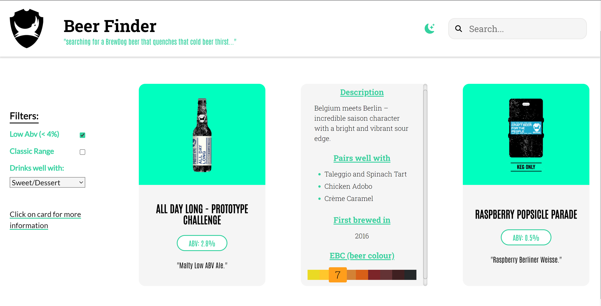
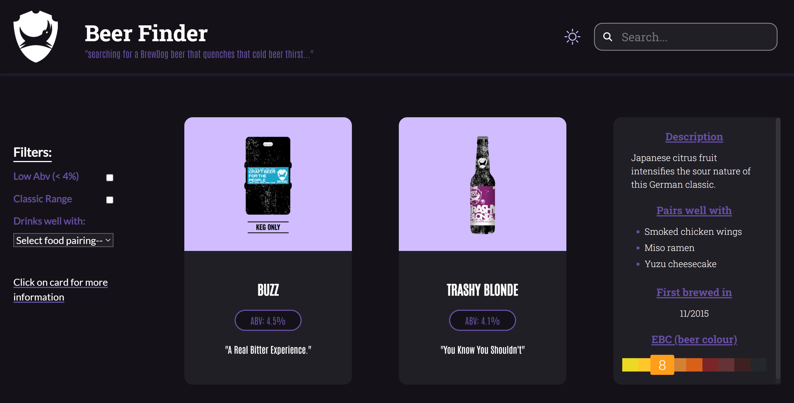

# BEER FINDER APP

Reworked BrewDog's PUNK Api (now deprecated) by using NEXTJS, fullstack framework to integrate into a NoSQL database.

VISIT:  https://find-me-a-beer.vercel.app/

# Outcomes: #

1. ability to search for beers via `name or letter` and page will update on input change  
2. can filter content on 3 conditions:   
    - Low Alcohol (ABV value less than or equal to 4%)  
    - Classic Range (was first brewed before 2010)  
    - Drop down menu for food pairing based on array of keywords

# Design/Display: # 

- mobile first design - viewable across mobile, tablet & laptop
- light and dark theme - using the html `data-*` attribute to target all html elements with css variables for colour scheme
- displays the beers in a card format using CSS Grid & flexbox
- flip card animation for more information
- styled using SASS, css modules and utilised BEM convention
- Fixed postion Header that hides main section of beers when scrolling
- Navigation bar that has a fixed position to enable actions (filtering) to be performed by user whilst scrolling
- beer colour scale chart --> used JS switch statement to highlight beer colour with conditional css classes. 

# Functions: #

- remodelled API into a NoSQL database and built database queries for fetching results: 
    - used MongoDB Atlas search for text searching
    - used aggregation pipeline for building multiple search queries & filtering
    - added limit to enable pagination
- utilised `searchParams` for the search function and filtering options'. -- Server-side fetching data and page rendering.
  - URL structure so that filtering is done accordingly by building upon an url query e.g: 
  base url = ` https://find-me-a-beer.vercel.app/beers?` 
  search input e.g. `&name=${searchTerm}` 
  filter options are added e.g. `&abv_lt=4`, `&brewed_before=2010-10-01` 
- search bar (input) that updates beers to be displayed
- 2 x checkboxes that use a setState to filter beer data via set condition(s)
- `react-intersection-observer` - to enable inifinte scrolling combined with pagination results/queries from database.
- `react-loader-spinner"` - loading spinners for animation of data loading & fetching next page of results 
- unit tested, using vitest and playwright

# SCREENSHOTS #

 

# RUN: #
- clone down repo
- `npm install`
- `npm start`
